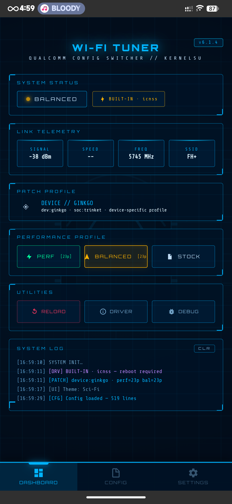
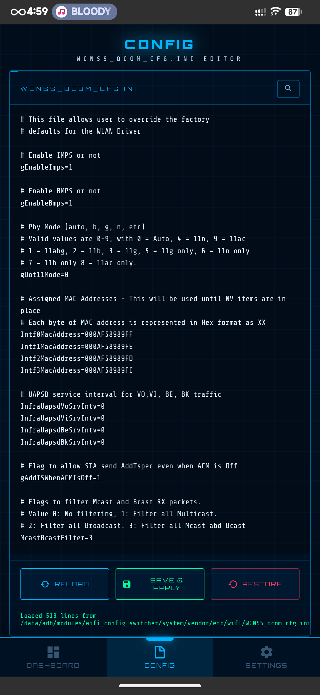
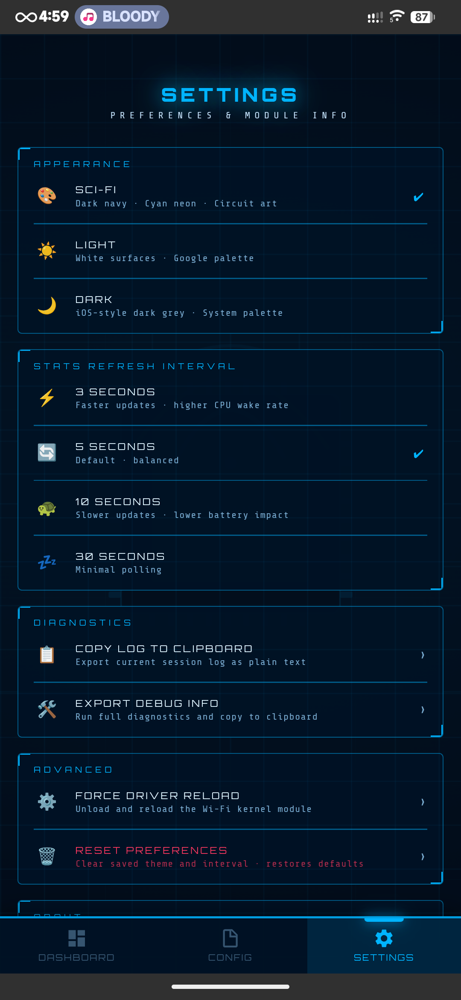
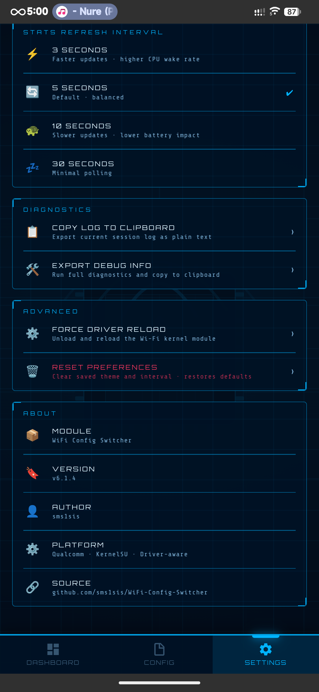

# Wi-Fi Config Switcher

> **Generic Qualcomm Edition** — patch-based Wi-Fi tuning for any Qualcomm Android device, managed through a clean WebUI inside KernelSU Manager.

<p align="center">
  
  
  
  
</p>

---

## What It Does

This Magisk/KernelSU module lets you switch your device's Wi-Fi driver configuration between three profiles without touching system partitions:

| Profile | Effect |
|---|---|
| **Performance** | Disables power-saving, maximises TX power, disables roam scanning |
| **Balanced** | Moderate power-saving, reduced TX power, roam scanning enabled |
| **Stock** | Restores the original unmodified config from backup |

All changes are **systemless** — the module overlays your vendor Wi-Fi config at install time and writes patches on top at runtime. A full uninstall leaves zero traces.

---

## Requirements

- Android device with a **Qualcomm Wi-Fi chipset** (WCN36xx / WCN39xx / QCA family)
- **KernelSU-Next V3** (or compatible Magisk build with WebUI support)
- Root access

---

## Installation

1. Download the latest `WiFi-Config-Switcher.zip` from [Releases](https://github.com/sms1sis/WiFi-Config-Switcher/releases).
2. Flash via **KernelSU Manager → Modules → Install from storage**.
3. During install the module will:
   - Detect your device codename and SoC platform automatically.
   - Select the most specific patch profile available (see [Patch Resolution](#patch-resolution) below).
   - Import your stock `WCNSS_qcom_cfg.ini` into the module overlay.
4. Reboot once after flashing.
5. Open **KernelSU Manager → Modules → Wi-Fi Config Switcher → Open WebUI**.

> **No reboot needed** to switch profiles on devices with a modular (loadable) Wi-Fi driver — the driver is reloaded automatically. Devices with a built-in (kernel-compiled) driver will prompt you to reboot.

---

## Packaging

To package the module yourself, run the following command in the project root:

```sh
zip -r WiFi-Config-Switcher.zip . -x ".git/*" ".gitignore" "README.md" "LICENSE" "screenshots/*" "changelog.md"
```

---

## WebUI

The WebUI is accessible directly from KernelSU Manager and shows:

- **Active mode badge** — current profile (Performance / Balanced / Stock)
- **Driver pill** — detected driver type (`Modular · qca_cld3_wlan` or `Built-in · wlan`) with colour coding
- **Patch profile card** — which patch is active and how it was matched (device / SoC / generic fallback)
- **Live stats** — Signal (dBm), Link speed (Mbps), Frequency (MHz), SSID
- **Reboot banner** — shown automatically when a built-in driver is detected after a config change
- **Log box** — timestamped, colour-coded log of every action taken

---

## Screenshots

<p align="center">
  
  
  
  
</p>

---

## Patch Resolution

At install time `customize.sh` reads your device properties and walks this priority chain, picking the **most specific** match:

```
patches/devices/<ro.product.device>/    ← 1st — exact device codename
       ↓ (alias map: sunny→mojito, sweet_k→sweet, …)
patches/soc/<ro.board.platform>/        ← 2nd — SoC platform family
       ↓
patches/generic_qcom/                   ← 3rd — safe fallback for any Qualcomm device
```

The resolved path is written to `patch_dir.txt` at install time so the backend never repeats `getprop` lookups at runtime.

### Included Patch Profiles

| Path | Covers |
|---|---|
| `patches/devices/sweet/` | Redmi Note 10 Pro (sweet) |
| `patches/devices/mojito/` | Redmi Note 10 / sunny (alias supported) |
| `patches/devices/ginkgo/` | Redmi Note 8 / willow (alias supported) |
| `patches/soc/sm7150/` | Snapdragon 730 / 730G / 732G |
| `patches/soc/sm6150/` | Snapdragon 675 / 710 / 712 |
| `patches/soc/sm6125/` | Snapdragon 665 — WCN3980 chipset |
| `patches/soc/sm8150/` | Snapdragon 855 / 855+ |
| `patches/soc/sm8250/` | Snapdragon 865 / 865+ |
| `patches/generic_qcom/` | Any Qualcomm device — conservative safe values |

---

## Adding a New Device

You don't need to touch any shell scripts. Just add two text files.

**Step 1 — Find your identifiers**
```sh
adb shell getprop ro.product.device    # e.g.  miatoll
adb shell getprop ro.board.platform   # e.g.  trinket
```

**Step 2 — Create a device patch** (most specific, recommended)
```sh
mkdir patches/devices/miatoll/
```

`patches/devices/miatoll/perf.patch`:
```ini
# Redmi Note 10S (miatoll) — Performance Profile
# SoC: Helio G95 — uses different param names if non-Qualcomm Wi-Fi
gEnableBmps=0
gEnableImps=0
gDataInactivityTimeout=0
TxPower2g=16
TxPower5g=15
gRoamScanOffloadEnabled=0
```

`patches/devices/miatoll/balanced.patch`:
```ini
# Redmi Note 10S (miatoll) — Balanced Profile
gEnableBmps=1
gEnableImps=1
gDataInactivityTimeout=200
TxPower2g=13
TxPower5g=13
gRoamScanOffloadEnabled=1
```

**Step 3 — Or create a SoC-level patch** (covers all devices on that platform)
```sh
mkdir patches/soc/trinket/
# add perf.patch and balanced.patch as above
```

**Step 4 — Submit a pull request** 🎉

### Patch File Format

```ini
# Lines beginning with # are comments — ignored at runtime
# Blank lines are ignored

KEY=VALUE

# The key must match the WCNSS_qcom_cfg.ini key exactly (case-sensitive).
# Existing keys (including commented-out ones) are updated in place.
# Missing keys are appended to the end of the config file.
# No stock.patch is needed — Stock mode always restores from the .bak backup.
```

---

## Driver Types

The module auto-detects which kind of Wi-Fi driver your kernel uses and adjusts its behaviour accordingly.

| Driver Type | Detection | Behaviour after config change |
|---|---|---|
| **Modular** (loadable `.ko`) | Found in `/proc/modules` or `/sys/module/` | Driver is unbound → rebound automatically. No reboot needed. |
| **Built-in** (compiled into kernel) | Subsystem is `platform`/`soc`, no `/proc/modules` entry | Config is written. WebUI shows a **Reboot Required** banner. |
| **Unknown** | Detection inconclusive | Config is written. Reload is skipped to avoid instability. Manual reboot advised. |

Detection uses six layered checks in order (symlink → `/sys/module` → `/proc/modules` → known module names → driver path → subsystem bus type) to maximise accuracy across different kernel configurations.

---

## File Structure

```
WiFi-Config-Switcher/
├── backend.sh              ← All backend logic (driver detect, patch apply, stats, reload)
├── customize.sh            ← Install-time: device detect, patch resolution, config import
├── service.sh              ← Sets execute permission on backend.sh at boot
├── module.prop             ← Module metadata
├── update.json             ← OTA update descriptor
├── webroot/
│   └── index.html          ← Full WebUI (single-file, no external dependencies at runtime)
└── patches/
    ├── README.md           ← Contributor guide for patch files
    ├── devices/
    │   ├── sweet/          ← Redmi Note 10 Pro
    │   │   ├── perf.patch
    │   │   └── balanced.patch
    │   ├── mojito/         ← Redmi Note 10 / sunny
    │   │   ├── perf.patch
    │   │   └── balanced.patch
    │   └── ginkgo/         ← Redmi Note 8 / willow
    │       ├── perf.patch
    │       └── balanced.patch
    ├── soc/
    │   ├── sm7150/         ← Snapdragon 730G / 732G
    │   ├── sm6150/         ← Snapdragon 675 / 710 / 712
    │   ├── sm6125/         ← Snapdragon 665 (WCN3980 — no TxPower params)
    │   ├── sm8150/         ← Snapdragon 855 / 855+
    │   └── sm8250/         ← Snapdragon 865 / 865+
    └── generic_qcom/       ← Safe fallback for any Qualcomm device
```

---

## How It Works (Technical)

1. **Install (`customize.sh`)** — Reads `ro.product.device` and `ro.board.platform`, resolves the best patch directory, writes `patch_dir.txt` and `patch_source.txt`, then copies the stock `WCNSS_qcom_cfg.ini` into the module overlay tree so Magisk/KSU can mount it systemlessly.

2. **Mode Apply (`backend.sh apply_mode`)** — Restores the `.bak` backup first (clean slate), then reads the selected `.patch` file line by line, applying each `KEY=VALUE` via `sed` (update existing) or append (new key). Writes the new mode to `mode_status.txt`.

3. **Driver Reload (`backend.sh soft_reset`)** — For modular drivers: disables Wi-Fi via `svc`, unbinds the device from its driver via sysfs, rebinds it, re-enables Wi-Fi. For built-in drivers: skips reload and instructs the WebUI to show the reboot banner.

4. **WebUI** — Pure HTML/JS served by KernelSU's built-in web server. Calls `backend.sh` via `window.ksu.exec()`. All log output is timestamped and colour-coded by type (info / success / warning / error / builtin).

---

## Troubleshooting

**"Config file not found"**
The module could not locate `WCNSS_qcom_cfg.ini` during install. Try manually finding it:
```sh
adb shell find /vendor /system -name "WCNSS_qcom_cfg.ini" 2>/dev/null
```
Then open a GitHub issue with your device codename and the path.

**"No patch directory found"**
No patch exists for your device or SoC and the `generic_qcom` folder is missing. Reinstall the module or add a patch file (see [Adding a New Device](#adding-a-new-device)).

**Profile applied but no effect**
If the driver is built-in (the WebUI will say so), you must reboot after applying a profile. The config is written correctly — only the running driver needs a restart.

**WebUI shows "KSU not detected (Browser Mode)"**
You're opening `index.html` directly in a browser instead of through KernelSU Manager. Open it via Manager → Modules → Wi-Fi Config Switcher → Open WebUI.

---

## Contributing

Pull requests for new device/SoC patches are very welcome. Please:

- Include the device codename, SoC platform, and model name in a comment at the top of the patch file.
- Test both profiles on your device before submitting.
- Keep `generic_qcom` values conservative — they run on hardware you haven't tested.

---

## License

GPL-3.0 — see [LICENSE](LICENSE).

---

## Credits

- **sms1sis** — original author and maintainer
- KernelSU-Next team for the WebUI exec API
